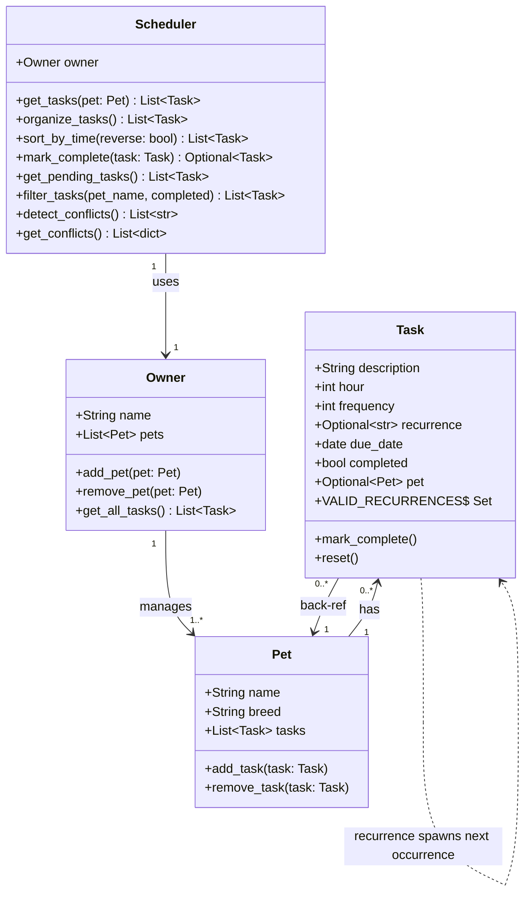

```mermaid
classDiagram

class Task {
    +String description
    +int hour
    +int frequency
    +Optional~str~ recurrence
    +date due_date
    +bool completed
    +Optional~Pet~ pet
    +VALID_RECURRENCES$ Set
    +mark_complete()
    +reset()
}

class Pet {
    +String name
    +String breed
    +List~Task~ tasks
    +add_task(task: Task)
    +remove_task(task: Task)
}

class Owner {
    +String name
    +List~Pet~ pets
    +add_pet(pet: Pet)
    +remove_pet(pet: Pet)
    +get_all_tasks() List~Task~
}

class Scheduler {
    +Owner owner
    +get_tasks(pet: Pet) List~Task~
    +organize_tasks() List~Task~
    +sort_by_time(reverse: bool) List~Task~
    +mark_complete(task: Task) Optional~Task~
    +get_pending_tasks() List~Task~
    +filter_tasks(pet_name, completed) List~Task~
    +detect_conflicts() List~str~
    +get_conflicts() List~dict~
}

Owner "1" --> "1..*" Pet : manages
Pet "1" --> "0..*" Task : has
Task "0..*" --> "1" Pet : back-ref
Scheduler "1" --> "1" Owner : uses
Task ..> Task : recurrence spawns next occurrence
```
