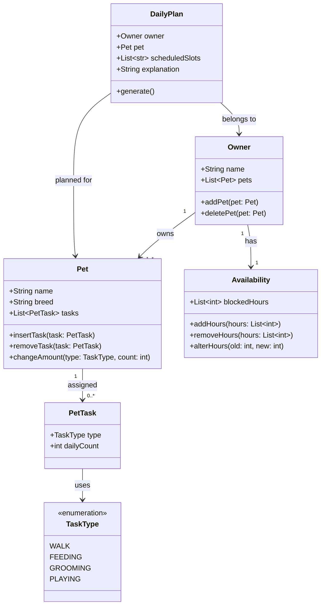

```mermaid
classDiagram

class Owner {
    +String name
    +List~Pet~ pets
    +addPet(pet: Pet)
    +deletePet(pet: Pet)
}

class Pet {
    +String name
    +String breed
    +List~PetTask~ tasks
    +insertTask(task: PetTask)
    +removeTask(task: PetTask)
    +changeAmount(type: TaskType, count: int)
}

class Availability {
    +List~int~ blockedHours
    +addHours(hours: List~int~)
    +removeHours(hours: List~int~)
    +alterHours(old: int, new: int)
}

class PetTask {
    +TaskType type
    +int dailyCount
}

class TaskType {
    <<enumeration>>
    WALK
    FEEDING
    GROOMING
    PLAYING
}

class DailyPlan {
    +Owner owner
    +Pet pet
    +List~str~ scheduledSlots
    +String explanation
    +generate()
}

Owner "1" --> "1..*" Pet : owns
Owner "1" --> "1" Availability : has
Pet "1" --> "0..*" PetTask : assigned
PetTask --> TaskType : uses
DailyPlan --> Owner : belongs to
DailyPlan --> Pet : planned for
```
